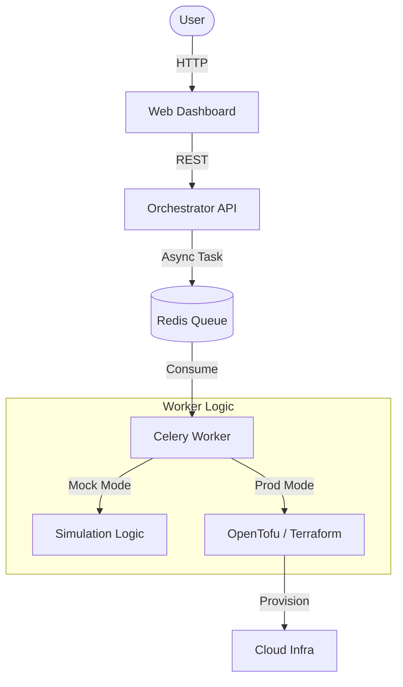

# 🛡️ CyberGuard 2.0: Cloud-Native Cyber Range

**One-click deployment of red/blue team training environments on OpenStack.**

CyberGuard is an Infrastructure-as-Code platform that automates the creation of vulnerable labs. It features a modern web dashboard an asynchronous REST API for automation.


## 🚀 Quick Start (Simulation Mode)

For now, by default, the project runs in **Simulation Mode**. This allows you to test the full UI/UX and API workflow locally without needing a real OpenStack cluster. It simulates infrastructure provisioning delays and generates realistic mock data.

### 1. Prerequisites
* **Python 3.10+**
* **Redis Server** (required for the message broker).
* **OpenTofu** (optional for Simulation Mode, required for Prod).

### 2. Running the Platform
You need to run the services in separate terminal windows.

**Terminal 1: Redis Broker**
Start the message queue service.
```bash
sudo systemctl start redis-server
```

**Terminal 2: Background Worker**
Processes the deployment tasks. We enable Mock Mode here.

```bash
cd services/scenario-orchestrator
pip install -r requirements.txt
export MOCK_MODE=true
celery -A tasks worker --loglevel=info --concurrency=3
```

**Terminal 3: Orchestrator API**
The REST backend that handles requests.

```bash
cd services/scenario-orchestrator
# If using a virtualenv, ensure it is activated
uvicorn api:app --host 0.0.0.0 --port 8000

```

**Terminal 4: Web Dashboard**
The frontend user interface.

```bash
cd webui
pip install -r requirements.txt
python3 app.py

```

### 3. Access

Open your browser at **http://localhost:5000**.

1. **Launch:** Select a scenario and click "Launch".
2. **Wait:** You will see the status change from "Pending" to "Deploying" (Simulating ~15s delay).
3. **Control:** Once "Active" (Green), click "Enter Control" to view the generated credentials and topology.


## ⚙️ Switching to Production (Real OpenStack)

To deploy actual infrastructure, you must disable Mock Mode and provide valid credentials.

1. Create a `.env` file in `services/scenario-orchestrator/` based on `.env.example`.
2. Update the configuration:

```bash
# .env config
MOCK_MODE=false             # <--- Disables simulation to use Real OpenTofu
OS_AUTH_URL=https://your-openstack:5000/v3
OS_USERNAME=admin
OS_PASSWORD=secret
OS_PROJECT_ID=your_project_id
OS_USER_DOMAIN_NAME=Default

```


## 🏗️ Architecture

The system uses an asynchronous microservice architecture to prevent UI freezing during long deployments.



* **WebUI:** Flask-based dashboard with Cytoscape.js topology visualization.
* **API:** FastAPI backend handling request validation and state management.
* **Worker:** Celery worker that executes Terraform commands in isolated workspaces (`runs/<id>`).
* **State:** SQLite database tracks active labs, IPs, and credentials.

---

## 📂 Project Structure

* **`webui/`**: Frontend application.
* **`services/scenario-orchestrator/`**: backend logic
* `api.py`: REST endpoints.
* `tasks.py`: Asynchronous worker tasks.
* `orchestrator.py`: Logic for Mock Mode and Terraform wrapping.
* `database.py`: SQLite persistence.
* **`infra/terraform/`**: Infrastructure-as-Code templates.

